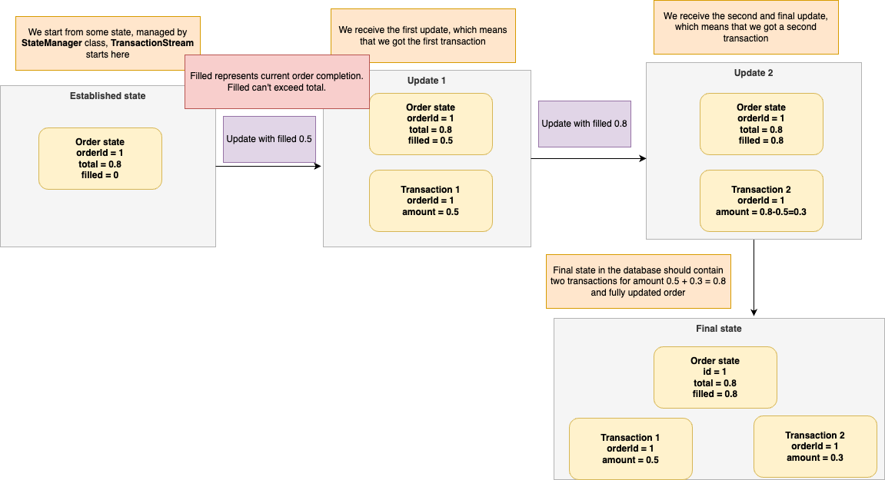

# Goal

The main goal of this task is to calculate transactions from order updates.

However, attached code contains various business logic and technical errors.
The goal is to track those errors and fix them.

# Application setup
SQL queries in `Queries.scala` are correct and should not be changed.

The main logic is contained within `TransactionStream` which processes a stream of updates of `OrderRow`.
<br> Using `processUpdate` method we want to calculate transactions but only if a long IO operation defined inside the method succeeds.
<br> Additionally, `TransactionStream` uses `StateManager` to manage the application state.
<br> The code is tested inside `TransactionStreamSpec`. It is advised to start debugging by running tests one by one.

In our model we have two classes: `OrderRow` which is essentially the aggregated state of the order.
From this aggregated state, we want to calculate transactions i.e. `TransactionRow` in a way stated in the flowchart below.

Before running tests use the docker compose file:

```shell
cd development && docker-compose up
```

# Introduction

Cryptocurrency exchanges usually provide websocket streams for clients to oversee their orders progress.
Common flowchart for calculating transactions from updates can be represented like this:


Those updates are cumulative per order.
Let's assume that `OrderRow` can be defined as:

````scala
case class OrderRow(
 orderId: String,
 market: String,
 total: BigDecimal,
 filled: BigDecimal,
 createdAt: Instant,
 updatedAt: Instant
)
````
Where `total` is the total amount of the order and `filled` is the current state of completion of the order.

All transactions must have positive (greater than zero) amount.

Typical order sequence goes like this, let's assume a tuple (sequence, total, filled) with a fixed order id

```
(1, 0.8, 0) ->
 -> (2, 0.8, 0.5) 
 -> (3, 0.8, 0.8)
```

This results in two transactions: one transaction for amount `0.5 - 0 = 0.5` and second one for amount `0.8 - 0.5 = 0.3`.
This case is presented in the flowchart.

Transaction can also get completed in a single go:

```
(1, 0.8, 0) -> (2, 0.8, 0.8) 
```

This results in one transaction for `0.8` amount.

The goal of this task is to find and calculate transactions for an order with a given id.

## General requirements

Note: Some of those cases are covered in tests, some are not. Which ones?

1. Test results must not be changed, unless proven wrong.
2. All tests inside `TransactionsStreamSpec` must pass. Particularly:
    1. On application shutdown, we should process all remaining and currently processing records
    2. If we receive the update and order is not present in the state, we want to wait until it is present in the state.
       If it isn't present in the state after 5 seconds pass, we can drop it.
    3. Same message can be delivered twice.
3. Transactions/orders must be inserted and updated only if `performLongRunningOperation` succeeds.
4. All updates should be processed concurrently. Introduce a parameter `maxConcurrent: Int` that dictates the max amount
   of concurrently processing updates. Write a test.<br> Hint: Orders with the same id must be processed sequentially
   regardless of the degree of concurrency.

## Given resources

A docker-compose file

```shell
cd development && docker-compose up
```

SQL queries (inside `com.example.persistence` package, migrations for orders and transactions tables, database pool of
connections)

Data model inside `com.example.model` package.

`StateManager` - an object that manages global orders state.

Main logic inside `TransactionStream`.
